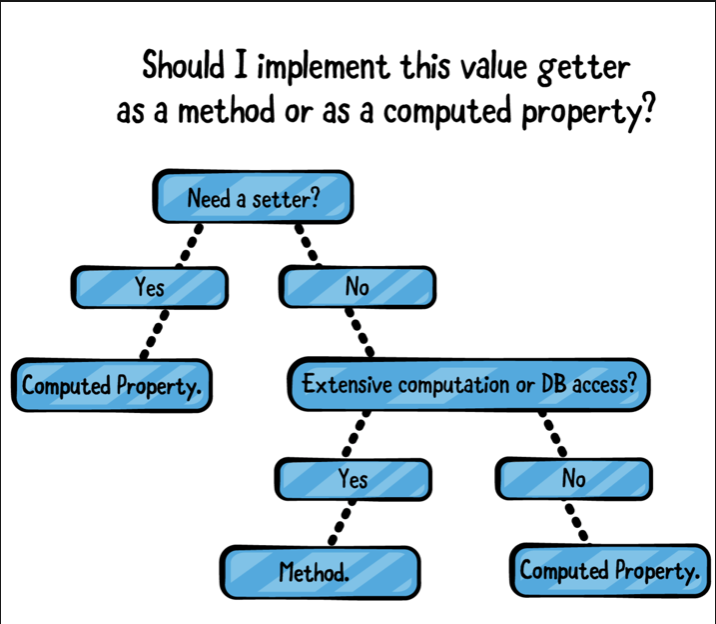
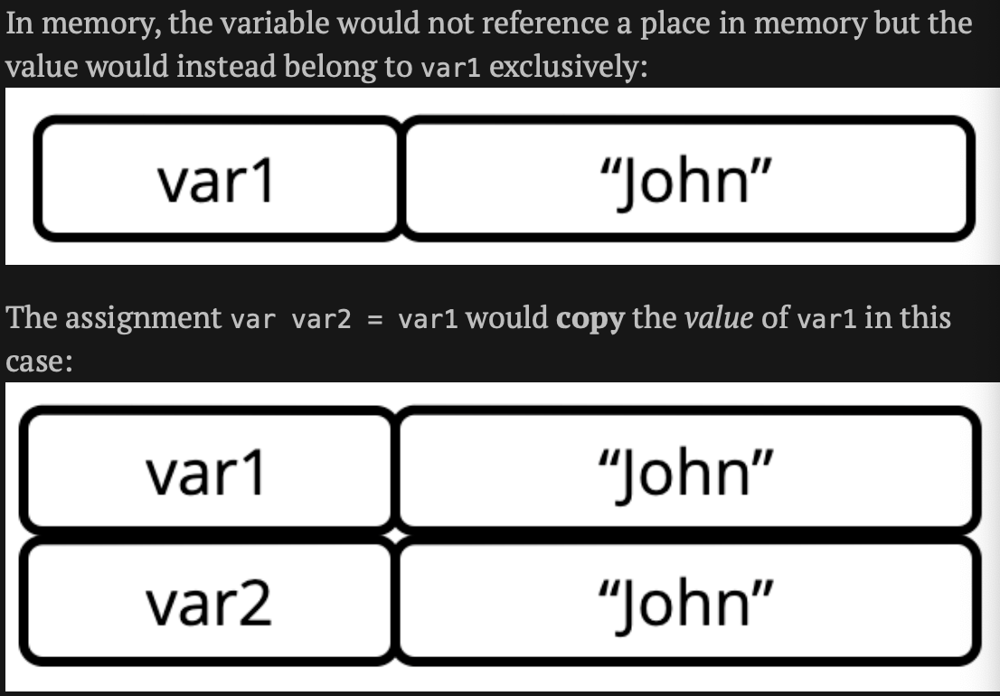
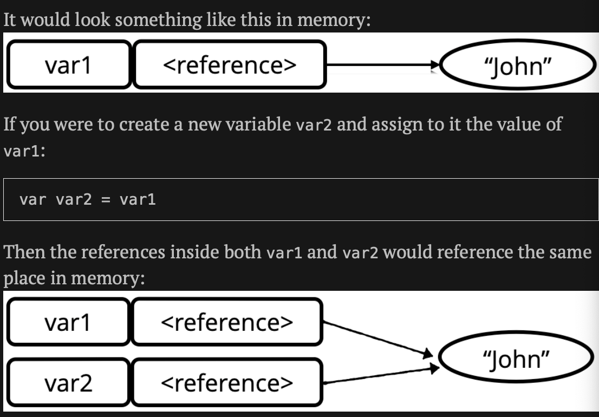

Swift Apprentice

## Swift Basics

1. 注释
   1. `//`
   2. `/**/`
2. 打印
   1. `print("hello!")`
3. 算数运算
   1. 加法：`+`
   2. 减法：`-`
   3. 乘法：`*`
   4. 除法：`/`
   5. 取模：`%`
   6. 位移：
      1. 左移：`<<`
      2. 右移：`>>`
   7. 运算符优先级：()
   8. `++/--，+=， -=， *=，/=`
4. 命名数据
   1. 常量，赋值后后面不可再变更:`let name: type = value, 比如:let number: Int = 10`
   2. 变量，赋值后后面根据需要可再变更:`var name; type = value,比如:var number: Int = 10`
   3. 命名规则
      1. 小写字母开头
      2. 驼峰命名
      3. In Swift, you can even use the full range of Unicode characters. var 🐶💩: Int = -1”


5. 类型 & 操作
   1. 类型转换: `let integer: Int = Int(doubleValue)`

   2. 混合类型操作:

      ```swift
      let hourlyRate: Double = 19.5
      let hoursWorked: Int = 10
      let totalCost: Double = hourlyRate * Double(hoursWorked)
      ```

      

   3. 类型推断

      ```swift
      let typeInferredDouble = 3.14159//swift会推断为Double类型，不要使用类型推断
      
      let actuallyDouble = 3 as Double//最好是这样子声明let actuallyDouble = 3.0
      ```

      

   4. Strings

      ```swift
      //字符
      let characterA: Character = "a"
      //字符串
      let stringDog: String = "Dog"
      //字符串拼接
      var message = "hello" + "world"
      message += stringDog
      message += String(characterA)
      
      message = "hello my name is \(name)"
      let oneThird = 1.0 / 3.0
      let oneThirdLongString = "One third is \(oneThird)"
      
      //多行字符串
      let bigString = """
          hello
          ni
          hao
          """
      ```

   5. Tuples:A tuple is a type that represents data composed of more than one value of any type.

   6. ```swift
      let coordinates: (Int, Int) = (2, 3)
      let coordinates = (2.0, 3)
      let x = coordinates.0
      let coordinatesNamed = (x: 2.0, y:3)
      let (a, b) = coordinatesNamed
      //忽略某个值
      let coordinates3D = (x:2, y:3, z:1)
      let (a1, b1, _) = coordinates3D
      ```

   7. Type aliases

      ```swift
      typealias Animal = String
      let myPet: Animal = "sss"
      typealias Coordiantes = (Int, Int)
      let xy: Coordiantes = (2, 1)
      ```

   8. Protocols

      1. Protocols are how types are organized in Swift. They describe the common operations that multiple types share.

6. Basic control Flow, 基础控制流

   1. 比较运算符

      1. Bool

      ```swift
      let doesOneEqualTwo: Bool = (1 == 2)
      let alsoTrue = !(1 == 2)
      let and = true && false
      let or = true && false
      let guess = "dog"
      let dogEqualsCat = guess == "cat"
      //在true和false切换
      let switchState = true
      switchState.toggle()
      x > 3 ? "xx" : "yy"// (<condition>) ? <true value> : <false value>
      ```

   2. if运算

      ```swift
      if 2 > 1 {
      
      } else if hourOfDay < 6 {
      
      } else {
      
      }
      
      if 2 > 1 && name == "xxx" {
        
      }
      ```

   3. 循环

      ```swift
      while true {
        break//immediately stops the loop's execution and continues on to the code after the loop
      }
      repeat {
        
      } while true
      ```

7. Advanced Control Flow

   1. Countable ranges

      ```swift
      let closeFange = 0...5//from 0 to 5
      let halfOpenRange = 0..<5//from 0 to 4
      ```

   2. Random interlude

      ```swift
      Int.random(in:1...6)// from 1 to 6
      ```

   3. For loops

      ```swift
      //for <constant> in <countalbe range> {}
      for i in 1...5 {}
      for _ in 0..<count {}
      for i in 1...count where i % 2 == 1 {}
      sum = 0
      //break and continue work on the innermost loop, so you need to use labeled statements to act on the outer loop.
      rowLoop: for row in 0..<8 {
          columnLoop: for column in 0..<8 {
              if row == column {
                  continue rowLoop
              }
              sum += row * column
          }
      }
      ```

   4. Switch statements

      ```swift
      switch string {
      	case "cat", "dog":
      		print("cat dog")
      	default:
      		print("default")
      }
      switch hourOfDay {
        case 0...5:
        	print("")
        case 20..<24:
        	print("")
      }
      
      switch number {
        case let x where x % 2 == 0:
        	print("even")
        case _ where number % 2 == 1:
        	print("xx")
        default:
        	print("Odd")
      }
      
      let coordinates = (x: 3, y: 2, z: 5)
      switch coordinates {
        case (0, 0, 0):
        	print("matches (0, 0, 0)")
        case (_, 0, 0):
        	print("matches y=0, z=0 and any value of x")
        case (0, _, 0):
        	print("matches x=0, z=0 and any value of y")
        case (0, 0, _):
        	print("matches y=0, x=0 and any value of z")
      }
      
      switch coordinates {
        case (0, 0, 0):
        	print("matches (0, 0, 0)")
        case (let x, 0, 0):
        	print("matches y=0, z=0 and x = \(x)")
        case (0, let y, 0):
        	print("matches x=0, z=0 and y = \(y)")
        case (0, 0, let z):
        	print("matches y=0, x=0 and z = \(z)")
        case let (x, y, z):
        	print("it matches anything")
      }
      
      switch coordinates {
        case let (x, y, _) where y == x:
        	print("x = y")
        case let (x, y, _) where y == x * x:
        	print("y == x * x")
        default:
        break
      }
      ```

### Functions

   1. Function basics

      ```swift
      func printMultipleOf(multiplier: Int, andValue: Int) {
          print("\(multiplier) \(andValue)")
      }
      printMultipleOf(multiplier: 1, andValue: 1)
      
      //and is external name
      //xx is internal name
      func printMultipleOf1(multiplier: Int, and xx: Int) {
          print("\(multiplier) \(xx)")
      }
      printMultipleOf1(multiplier: 3, and: 2)
      
      func printMultipleOf2(_ multiplier: Int, xx yy: Int) {
          print("\(multiplier) \(yy)")
      }
      printMultipleOf2(3, xx: 3)
      
      func printMultipleOf3(_ multiplier: Int, _ value: Int) {
          print("\(multiplier) \(value)")
      }
      printMultipleOf3(3, 4)
      //give default values to parameters
      func printMultipleOf4(_ multiplier: Int, _ value: Int = 1) {
          print("\(multiplier) \(value)")
      }
      printMultipleOf4(4)
      
      func multiply(_ number: Int, by multiplier: Int) -> Int {
          return number * multiplier
      }
      
      print(multiply(4, by: 2))
      //you can do this because the function is a single statement. If the function had more lines of code in it, then you wouldn't be able to do this.
      func multiply1(_ number: Int, by multiplier: Int) -> Int {
          
          number * multiplier
      }
      print(multiply1(5, by: 2))
      
      func multiplyAndDivide(_ number: Int, by factor: Int) -> (product: Int, quotient: Int) {
          return (number * factor, number / factor)
      }
      let results = multiplyAndDivide(4, by: 2)
      let product = results.product
      let quotient = results.quotient
      ```

   2. Advanced Parameter handling

      Function parameters are constants by default, which means they can't be modified.

      ```swift
      /*
       The parameter values is the equivalent of a constant declared with let. Therefore, when the function attempts to increment it, the compiler emits an error.
       It is important to note that Swift copies the value before passing it to the function, a behavior known as pass-by -value
       */
      func incrementAndPrint(_ value: Int) {
        value += 1
        print(value)
      }
      incrementAndPrint(3)
      
      /*
      Sometimes you do want to let a function change a parameter directly, a behavior known as copy-in copy-out or call by value result. You do it like so:
      inout before the parameter type indicates that this parameter should be copied in, that local copy used within the function, and copied back out when the function returns.
      The argument value isn’t copied into the parameter. Instead, the parameter will hold a reference to the memory of the original value. This optimization satisfies all requirements of copy-in copy-out while removing the need for copies.
      */
      func incremetAndPrint(_ value: inout Int) {
        value += 1
        print(value)
      }
      var value = 5
      incrementAndPrint(&value)
      ```
      
   3. Overloading

      ```swift
      func getValue() -> Int {
          32
      }
      func getValue() -> String {
          "sss"
      }
      /*
      This will correctly call the Int version of getValue() in the first instance, and the String version of getValue() in the second instance.
      It’s worth noting that overloading should be used with care. Only use overloading for functions that are related and similar in behavior.
      */
      let valueInt: Int = getValue()
      let valueString: String = getValue()
      
      ```

   4. Functions as variables

      ```swift
      func add(_ a: Int, _ b: Int) -> Int {
          a + b
      }
      
      func printResult(_ function: (Int, Int) -> Int, _ a: Int, _ b: Int) {
          let result = function(a, b)
          print(result)
      }
      
      printResult(add, 3, 4)	
      ```

   5. The land of no return

      ```swift
      /*
      It’s useful because by the compiler knowing that the function won’t ever return, it can make certain optimizations when generating the code to call the function.
      */
      func noReturn() -> Never {
          while true {
              
          }
      }
      ```

   6. Commenting your functions

      ```swift
      /* 自动生成注释 
      	option+command+/
      */
      /// Calculates the average of three values
      /// - Parameters:
      ///   - a: The first value.
      ///   - b: The second value.
      ///   - c: The third value.
      /// - Returns: The average of the three values.
      func calculateAverage(of a: Double, and b: Double, and c: Double) -> Double {
        let total = a + b + c
        let average = total / 3
        return average
      }
      ```

### Options

   `Optional`, that handles the possibility a value could be nil.

   An optional is allowed to hold either a value or nil. Remember, non-optional type are guaranteed to have an actual value.

   You should use force unwrapping sparingly

   ```swift
   var errorCode: Int?
   errorCode = 100
   /*It doesn’t work because you’re trying to add an integer to a box — not to the value inside the box, but to the box itself. That doesn’t make sense.*/
   print(errorCode! + 1)
   //Force unwrapping
   errorCode!
   //optional binding
   errorCode = nil
   if errorCode != nil {
   } else { return }
   if let unwrappedErrorCode = errorCode {
     print(unwrappedErrorCode)
   } else { return }
   
   if let errorCode = errorCode {} else { return }
   // it will only execute the if part of the statement when both optionals contain a value
   if let authorName = authorName,
   	 let authorAge = authorAge {} else { return }
   /*
   the expression in the if statement will only be true if name is non-nil, and age is non-nil, and age is greater than or equal to 40.
   */
   if let authorName = authorName,
      let authorAge = authorAge,
   	 authorAge >= 40 {} else { return }
   
   ```

   guard statement

   The guard statement comprises guard followed by a condition that can include both Boolean expressions and optional bindings.

   that this must return if the statement in the guard is false, thus the compiler can make sure that you have added a return.

   ```swift
   func guardMyCastle(name: String?) {
     
     guard let castleName = name else { return }
     print(name)
   }
   
   func calculateNumberOfsides(shape: String) ->Int? {
     switch shape {
       case "Triangle":
       	return 3
       case "Square":
       	return 4
       default:
       	return nil
     }
   }
   
   func maybePrintSides(shape: String) {
     let sides = calculateNumberOfSides(shape: shape)
     if let sides = sides {
       print(sides)
     } else { return }
   }
   
   func maybePrintSides(shape: String) {
     guard let sides = calculateNumberOfSides(shape: shape) else { return }
     print(sides)
   }
   ```

   Nil coalescing

   in the case of nil, you'll use a default value.

   ```swift
   var optionalInt: Int? = 10
   var mustHaveResult = optionalInt ?? 0
   
   if let optionalInt = optionalInt { mustHaveResult = optionalInt } else { mustHaveResult = 0}
   ```

   

### Collection Types

    If the collection doesn’t need to change after you’ve created it, you should make it immutable by declaring it as a constant with let. Alternatively, if you need to add, remove or update values in the collection, then you should create a mutable collection by declaring it as a variable with var.

    Arrays, Dictionaries, Sets

1. arrays,

   when you want to store your items in a particular order.
   
   ```swift
   /*
   Since the array literal only contains integers, Swift infers the type of evenNumbers to be an array of Int values. This type is written as [Int]. The type inside the square brackets defines the type of values the array can store, which the compiler will enforce when you add elements to the array.
   */
   //Creating arrays
   let evenNumbers = [2, 4, 6,8]
   var subscribers: [String] = []
   let allZeros = Array(repeating: 0, count: 5)//[0, 0, 0, 0, 0]
   let vowels = ["A", "E", "I", "O", "U"]
   /*
   Accessing elements
   1. Using properties and method
   */
   vowels.isEmpty
   vowels.count
   vowels.first
   vowels.last
   vowels.min()
   vowels.max()
   print(vowels as Any)
   print(vowels.first as Any)
   print([2,1,3].first as Any)
   vowels[0]
   //using countable ranges to make an arrayslice
   let upcomingPlayersSlice = vowels[1...2]//["E", "I"]
   let upcomingPlayersArray = Array(vowels[1...2])
   //Checking for an element
   func isEliminated(player: String) -> Bool {
     !players.contains(player)
   }
   //using contains(_:)
   players[1...3].contains("E")//true
   /* 
   Modifying arrays
   appending elements: using append(_:), +=
   Inserting elements: insert(_:at:)
   removing elements: removeLast(),remove(at:)
   finding elements: firstIndex(of:)
   updating elements:
   moving elements: swapAt(_:_:)
   sorting elements: sorted(), sort()
   //if you'd like to leave the original array untouched and return a sorted copy instead, use sorted() instead of sort().
   */
   players.append("G")
   players += ["G"]
   players.insert("G", at: 0)
   players.removeLast()
   players.remove(at:2)
   print(vowels.firstIndex(of: "Y") as Any)//nil
   vowels[0...1] = ["$", "3"]//be careful to not use an index beyond the bounds of the array, or your code will crash.
   vowels.swapAt(1,3)
   
   /*
   Iterating through an array
   */
   // from index 0 up to players.count
   for player in players { print(player) }
   for (index, player) in players.enumerated() { print("\(index) \(player)")}
   
   ```


​       

2. dictionaries

   A dictionary is an unordered collection of pairs, where each pair comprises a key and a value.

   All keys have to be of the same type, and all values have to be of the same type.

   ```swift
   //Creating dictionaries
   //dictionary literal
   var namesAndScores = ["anna": 2, "Brian": 2]
   //empty dictionary literal
   namesAndScoures = [:]
   var namesAndScoures: [String: Int] = [:]
   namesAndScoures.reserveCapacity(4)
   /*
   Accessing values
   using subscripting
   */
   namesAndScoures["anna"]// 2
   namesAndScoures["222"]// nil
   //using properties and methods
   namesAndScoures.isEmpty
   namesAndScoures.count
   /*
   Modifying dictionaries
   Adding pairs: updateValue(_:_)
   updating values: updateValue(_: forKey:)
   removing pairs: removeValue(forKey:)
   */
   //the dictionary is of type [String: Int], and it's mutable because it's assigned to avariable.
   namesAndScoures.updateValue("bb": 4)
   namesAndScoures["dd"] = 3
   //replaces the value of the given key with the new value and returns the old value. If the key doesn’t exist, this method will add a new pair and return nil.
   namesAndScoures.updateValue("anna", forKey:5)//return 2
   namesAndScoures["anna"] = 3
   namesAndScoures.removeValue(forKey: "anna")
   //If you’re using a dictionary that has values that are optional types, dictionary[key] = nil still removes the key completely. If you want keep the key and set the value to nil you must use the updateValue method.
   namesAndScoures["anna"] = nil
   
   //Iterating through dictionaries
   for (player, score) in namesAndScoures {
     print("\(player) - \(score)")
   }
   for player in namesAndScores.keys {
     
   }
   
   ```


​       

3. sets

   A set is an unordered collection of unique values of the same type.

   ```swift
   //Creating sets
   let setOne: Set<Int> = [1]
   //Set literals
   var explicitSet: Set<Int> = [1, 3, 3]//{1, 3}
   var someSet = Set([1, 2, 3])
   //Accessing elements
   someSet.contains(1)
   //Adding and removing elements
   // insert(_:) 
   // remove(_:), returns the removed element if it's in the set, or nil otherwise
   someSet.insert(5)
   someSet.remove(1)


​    

#### Collection Iteration with Closures

A closure is simply a function with no name; you can assign it to a variable and pass it around like any other value.

1. Closure basics

Closures are so named because they can "close over" the variables and constants within the closure's own scope. This simply means that a closure can access the values of any variable or constant from the surrounding context. Variables and constants used within the body of a closure are said to have been captured by the closure.

To use a closure, you first have to assign it to a variable or constant.

```swift
//declaration of a variable that can hold a closure an initialized
var multiplyClosure: (Int, Int) ->Int = { (a: Int, b: Int) -> Int in
    return a * b
}
var multiplyClosures = { (a: Int, b: Int) -> Int in
    return a * b
}
multiplyClosure(3, 4)//12
//Shorthand syntax
var multiplyClosures1: (Int, Int) ->Int
multiplyClosures1 = { (a, b) in 
	a * b     
}
//you can even omit the parameter list if you want. Swift lets you refer to each parameter by number, starting at zero, like so:
// only be used when the closure is short and sweet
multiplyClosures1 = {
  $0 * $1
}
func addFunction(_ a: Int,_ b: Int) -> Int {
  $0 + $1
}
//The third parameter is named operation and is of a function type.
func operateOnNumbers(_ a: Int, _ b: Int,
                      operation: (Int, Int) -> Int) -> Int {
    let result = operation(a, b)
    return result
}
operateOnNumbers(2, 3, operation: multiplyClosure)//6
operateOnNumbers(2, 3, operation: addFunction)//5

operateOnNumbers(4, 2, operation: { (a: Int, b: Int) -> Int in
    return a * b
})
//reduce the above to the following
operateOnNumbers(4, 2, operation: {$0 + $1})
operateOnNumbers(4, 2, operation: +)
//This is called trailing closure syntax, it can only be done when the closure is the final parameter passed to a function. move the closure outside of the function call:
operateOnNumbers(4, 2) {
    $0 + $1
}
//Multiple trailing closures syntax
func sequenced(first: ()->Void, second: ()->Void) {
    first()
    second()
}
//type in the name of the method(or code complete it) and then press the return key twice.
sequenced {
    print("first")
} second: {
    print("second")
}
//Closures with no return value
//the closure's type is () -> Void
// Void is actually just a typealias for (), This means you could have written() -> Void as () -> (). A function's parameter list however must always be surrounded by parentheses, so Void -> () or Void -> Void are invalid.
let voidClosure:() -> Void = {
    print("good")
}
voidClosure()

//Capturing from the enclosing scope
//The closure is able to access the variable because the closure is defined in the same scope as the variable. The closure is said to capture the counter variable. Any changes it makes to the variable are visible both inside and outside the closure.
var counter = 0
let incrementCounter = {
    counter + 1
}
incrementCounter()

func countingClosure() -> () -> Int {
    var counter = 0
    let incrementCounter: () -> Int = {
        counter += 1
        return counter
    }
    return incrementCounter
}

let counter1 = countingClosure()
let counter2 = countingClosure()

counter1()//1
counter2()//1
counter1()//2
counter1()//3
counter2()//2

//Custom sorting with closures
let names = ["a", "c", "b", "d"]
names.sorted()//["a", "b", "c", "d"]
print(names.sorted {
    $0 > $1
})//["d", "c", "b", "a"]
names//["a", "c", "b", "d"]

//Iterating over collections with closures
names.forEach { empty in
    print("value:\(empty)")
}
names.forEach {
    print("value2:\($0)")
}
/*
filter
map
reduce

compactMap
flatMap
first
*/

//the filter function then returns an array of Elements
//The closure's job is to return true or false depending on whether or not the value should be kept or not.
//The array returned from filter will contain all elements for which the closure returned true.
//The array that is returned from filter(and all of these functions) is a new array. The original is not modified at all.
let beforeAs = names.filter {
    $0 > "a"
}
let beforeAs1 = names.filter { temp in
    temp > "a"
}
print(beforeAs)//["c", "b", "d"]
print(beforeAs1)//["c", "b", "d"]
//only interested in the first element that satifies a certaion condition, use first(where:)
let largeAlpha = names.first { emp  in
    emp > "b"
}
let largeAlphab = names.first {
    $0 > "b"
}
print(largeAlpha as Any)//Optional("c")
print(largeAlphab as Any)//Optional("c")
//The map function will take a closure, execute it on each item in the array and return a new array containing each result with the order maintained. In this case
let appends = names.map { emp in
    emp + "c"
}
let appendsC = names.map {
    $0 + "c"
}
let changes = names.map {
    //Int($0)
    [$0]
}
print(appends)
print(appendsC)
print(changes)//[["a"], ["c"], ["b"], ["d"]]
//if you want to filter out the invalid(missing) values, you can use compactMap
let anyArray = ["2", "4", "e", "#"]

let numbers = anyArray.compactMap{
    Int($0)
}
print(numbers)//[2, 4]

//Swift expects the return value from the closure given to flatMap to be a collection itself. What it does then takes all these collections and concatenates them together. 
//So in this case, it's done the trick of unwrapping those inner collections. We end up with a collection containing all the items from the first inner collection, then all the items from the second inner collection, and so on.
let nestedArrays = [["0", "1"], ["a", "b", "c"], ["cat"]]
let unwrapInnerCollections = nestedArrays.flatMap {
    $0
}
print(unwrapInnerCollections)//["0", "1", "a", "b", "c", "cat"]
//This function takes a starting value and a closure. 
//The closure takes two values: the current value and an element from the array. 
//The closure returns the next value that should be passed into the closure as the current value parameter
let prices = [2, 2, 3, 3, 4, 4]
let sum = prices.reduce(-4) { res, emp in
    emp + res
}
let sum1 = prices.reduce(-4) {
 $0 + $1
}
print(sum)//14
print(sum1)//14

let stock = [1.5: 5, 10:2, 4.99:3]
let stockSum = stock.reduce(0) { rest , dic in
    return rest + dic.key * Double(dic.value)
}
let stockSum1 = stock.reduce(0) {
    $0 + $1.key * Double($1.value)
}
print(stockSum1)//42.47
print(stockSum)//42.47

//There’s another form of reduce named reduce(into:_:). You’d use it when the result you’re reducing a collection into is an array or dictionary
let farmAnimals = ["🐎": 5, "🐄": 10, "🐑": 50, "🐶": 1]

let allAnimals = farmAnimals.reduce(into: []) { (result, this: (key: String, value: Int)) in
    for _ in 0 ..< this.value {
        result.append(this.key)
    }
}

let allAnimals1 = farmAnimals.reduce(into: []) {
    for _ in 0 ..< $1.value {
        $0.append($1.key)
    }
}
//The dropFirst function takes a single parameter that defaults to 1 and returns an array with the required number of elements removed from the front
var prices = [2, 2, 3, 3, 4, 4]
prices.dropFirst()
prices.dropFirst(3)
prices.dropLast()
prices.dropLast(3)
prices.prefix(2)
prices.suffix(2)
prices.removeAll() { $0 > 3}//remove 44
prices.removeAll()

//Lazy collections
//Lazy collections are extremely useful when the collection is huge (even infinite) or expensive to generate. It saves the computation until precisely when it is needed.
func isPrime(_ number: Int) -> Bool {
    if number == 1 { return false}
    if number == 2 || number == 3 { return true}
    
    for i in 2...Int(Double(number).squareRoot()) {
        if number % i == 0 { return false }
    }
    return true
}

//var primes: [Int] = []
//var i = 1
//while primes.count < 10 {
//    if isPrime(i) {
//        primes.append(i)
//    }
//    i += 1
//}
/*
Notice that you start with the completely open-ended collection 1... which means 1 until, well, infinity (or rather the maximum integer that the Int type can hold!). Then you use lazy to tell Swift that you want this to be a lazy collection. Then you use filter() and prefix() to filter out the primes and choose the first ten.
At that point, the sequence has not been generated at all. No primes have been checked. It is only on the second statement, the primes.forEach that the sequence is evaluated and the first ten prime numbers are printed out. Neat! :]
Lazy collections are extremely useful when the collection is huge (even infinite) or expensive to generate. It saves the computation until precisely when it is needed.
*/
let primes = (1...).lazy
    .filter { isPrime($0) }
    .prefix(10)
    
primes.forEach { print($0) }

```

### Strings

    ```swift
    let string = "matt"
    for char in string {
    print(char)
    }
    let cafeNormal = "café"
    let cafeCombining = "cafe\u{0301}"
    
    cafeNormal.count     // 4
    cafeCombining.count  // 4
    cafeNormal.unicodeScalars.count     // 4
    cafeCombining.unicodeScalars.count  // 5
    for codePoint in cafeCombining.unicodeScalars {
      print(codePoint.value)
    }
    let firstIndex = cafeCombining.startIndex
    let firstChar = cafeCombining[firstIndex]
    let lastIndex = cafeCombining.index(before: cafeCombining.endIndex)
    let fourthIndex = cafeCombining.index(cafeCombining.startIndex, offsetBy:3)
    let backwardsName = name.reversed()
    //do this, you end up making a reversed copy of the original string with its own memory storage. Staying in the reversed collection domain will save memory space, which is fine if you don't need the whole reversed string.
    print(String(backwardsName))
    let secondCharIndex = backwardsName.index(backwardsName.startIndex, offsetBy: 1)
    print(backwardsName[secondCharIndex])
    
    //Raw strings
    let raw1 = #"Raw "No Escaping" \(no interpolation!). Use all the \ you want!"#
    print(raw1)//Raw "No Escaping" \(no interpolation!). Use all the \ you want!
    let raw2 = ##"Aren't we "# clever"##
    print(raw2)//Aren't we "# clever
    let raw3 = "can do that too"
    let raw4 = #"Yes We \#(raw3)!"#
    print(raw4)//Yes We can do that too!
    
    //Substrings
    //A Substring shares the storage with its parent String that it was sliced from. This means that when you’re in the process of slicing a string, you use no extra memory. Then, when you want the substring as a String you explicitly create a new string and the memory is copied into a new buffer for this new string.
    let fullName = "Matt Galloway"
    let spaceIndex = fullName.firstIndex(of: " ")!
    let firstName = fullName[fullName.startIndex..<spaceIndex]//Matt
    let firstName1 = fullName[..<spaceIndex]//Matt
    let lastName = fullName[fullName.index(after: spaceIndex)...]//Galloway
    let lastNameString = String(lastName)
    
    //Character properties
    let singleCharacter: Character = "x"
    let emoji: Character = "🈷️"
    let hexDigit: Character = "d"
    let thaiNine: Character = "๙"
    singleCharacter.isASCII
    emoji.isASCII
    singleCharacter.isWhitespace
    hexDigit.isHexDigit//true
    thaiNine.wholeNumberValue
    
    //Encoding
    //Strings are made up of a collection of Unicode code points. These code points range from the number 0 up to 1114111
    //UTF-8
    //This uses 8-bit code units instead.
    
    ```

### Building Your Own Types

    You can create your own type by combining variables and functions into a new type definition.

    Swift includes four kinds of named types: structures, classes, enumerations and protocols.

    - Structures

    - Properties

    - Methods

    - Classes

    - Advanced Classes

    - Enumerations

    - Protocols

    - Generics 

    

    1. Structures

       Structures are types that can store named properties and define actions and behaviors.

       ```swift
       //Swift automatically provides initializers for structures with all the properties in the parameter list.
       //Defining a property as constant or variable determines if you can change it.
       //In addition to choosing whether your properties should be variable or constants, you must also declare the structure itself as a variable if you want to be able to modify it auter it7s initialized.
       struct Location {
           let x: Int
           let y: Int
       }
       
       struct DeliveryArea {
           let center: Location
           var radius: Double
       }
       let storeLocation = Location(x: 3, y: 4)
       var storeArea = DeliveryArea(center: storeLocation, radius: 2)
       //Accessing members
       print(storeArea.radius)
       storeArea.radius = 250
       func distance(from source:(x: Int, y: Int), to target: (x: Int, y: Int)) -> Double {
           let distanceX = Double(source.x - target.x)
           let distanceY = Double(source.y - target.y)
           return (distanceX * distanceX + distanceY * distanceY).squareRoot()
       }
       //Much like a structure can have constants and variables, it can also define its own functions
       struct DeliveryArea {
           let center: Location
           var radius: Double
           func contains(_ location: Location) -> Bool {
               let distanceFromCenter = distance(from: (center.x, center.y), to: (location.x, location.y))
               return distanceFromCenter < radius
           }
       }
       
       //Structures as values
       /*
       The term value has an important meaning when it comes to structures in Swift, and that's because structures create what are known as value types.
       A value type is a type whose instances are copied on assignment.
       var a= 5 
       var b = a
       This copy-on-assignment behavior means that when a is assigned to b, the value of a is copied into b.
       */
       
       //Conforming to a protocol
       //Protocols contain a set of requirements that conforming types must satisfy.
       ```

       

    2. Properties

       The values inside a stucture are called properties.

       ```swift
       struct Car {
           let make: String
           let color: String
       }
       //The two properties of Car are stored properties, which means they store actual string values for each instance of Car.
       //Some properties calculate values rather than tore them. there's no actual memory allocated for them; rather, they get calculated on-the-fly each time you access them. called computed properties.
       
       //Stored properties
       struct Contact {
           var fullName: String
           let emailAddress: String
           var relationship = "Friend"// Default value
       }
       
       var person = Contact(fullName: "Grace Murray", emailAddress: "grace@navy.mil")
       var boss = Contact(fullName: "Ray", emailAddress: "ray@ray.com", relationship: "boss")
       
       // Computed properties
       // While a stored property can be a constant or a variable, a computed property must be defined as a variable.
       //Computed properties must also include a type, because the compiler needs to know what to expect as a return value.
       struct TV {
           var height: Double
           var width: Double
           //read-only computed property
           var diagonal: Int {
               let result = (height * height + width * width).squareRoot().rounded()
               return Int(result)
           }
         
       }
       var tv = TV(height: 2, width: 4)
       tv.diagonal
       //getter and setter
       struct TV {
           var height: Double
           var width: Double
           //read-write computed proerty
           var diagonal: Int {
               get {
                   let result = (height * height + width * width).squareRoot().rounded()
                   return Int(result)
               }
               
               set {
                   let ratioWidth = 16.0
                   let ratioHeight = 9.0
                   
                   let ratioDiagonal = (ratioWidth * ratioWidth + ratioHeight * ratioHeight).squareRoot()
                   height = Double(newValue) * ratioHeight / ratioDiagonal
                   width = height * ratioWidth / ratioHeight
               }
           }
       }
       tv.diagonal = 70
       
       //Type properties
       struct Level {
           static var highestLevel = 1
           let id: Int
           var boss: String
           var unlocked: Bool
       }
       
       let level1 = Level(id: 1, boss: "C", unlocked: true)
       let level2 = Level(id: 2, boss: "S", unlocked: false)
       let level3 = Level(id: 3, boss: "CH", unlocked: false)
       let level4 = Level(id: 4, boss: "Y", unlocked: false)
       let highestLevel = Level.highestLevel
       //level3.highestLevel
       
       //Property observers
       //willSet and didSet observers are only available for stored properties.
       // willSet and didSet observers are not called when a property is set during initialization. That means property observers are only useful for variable properties since constant properties are only set during initialization. Select between var and let according to match your needs.
       struct Level {
           static var highestLevel = 1
           let id: Int
           var boss: String
           
           var unlocked: Bool {
               didSet {
                   if unlocked && id > Self.highestLevel {
                       Self.highestLevel = id
                   }
               }
       //        willSet {
       //
       //        }
           }
       }
       
       var level3 = Level(id: 3, boss: "CH", unlocked: false)
       level3.unlocked = true
       
       //Limiting a variable
       struct LightBulb: CustomStringConvertible {
           static let maxCurrent = 40
           var description: String {
               "\(current)"
           }
           var current = 0 {
               didSet {
                   if current > LightBulb.maxCurrent{
                       print("""
                           current is too high,
                           falling back to previous setting.
                           """)
                       current = oldValue
                   }
               }
           }
       }
       
       var light = LightBulb()
       light.current = 50
       print(light)
       light.current = 3
       print(light)
         
       //Lazy properties
         struct Circle {
           //pi, as a lazy stored property, is only calculated the first time.
           //the lazy property must be a variable
           lazy var pi = {
               ((4.0 * atan(1.0 / 5.0)) - atan(1.0 / 239.0)) * 4.0
           }()
           var radius = 0.0
           var circuference: Double {
             //since the value of pi changes, the circumference getter must be marked as mutating. Accessing the value of pi changes the value of the structure.
             //since pi is a stored property of the structure, you need a custom initializer to use only the radius. Remember the automatic initializer of a structure includes all of the stored properties.
               mutating get {
                   pi * radius * 2
               }
           }
           
           init(radius: Double) {
               self.radius = radius
           }
       }
       
       var circle = Circle(radius: 5)
       print(circle)//Circle($__lazy_storage_$_pi: nil, radius: 5.0)
       circle.circuference//31.4
       circle.pi = 4
       circle.circuference//40
       print(circle.pi)//4
       
       ```

       

    3. Methods 

    Self: Access static properties from inside a struct.

    self: access the value of an instance. most of the time you don't need to, you can just use a variable name.


    


    ```swift
    //Initializers
    struct SimpleDate {
      var month: String
      init() {
        month = "January"
      }
    }
    
    SimpleDate()
    struct SimpleDate {
      var month: String = "January"
      var day: Int = 1
    }
    SimpleDate()
    SimpleDate(month: "February", day: 14)
    
    //mutating methods
    /*
    Methods in structures cannot change the values of the values of the instance without being marked as mutating.
    The mutating keyword marks a method that changes a structure's value. Since a structure is a value type, the system copies it each time it's passed around an app. If a method changes the value of one of the properties, then the original instance and the copied instance will no longer be equivalent.
    
    By marking a method as mutating, you're also telling the Swift compiler this method must not be called on constants. This is how Swift knows which methods to allow and which to reject at compile time.
    
    For mutating methods, Swift secretly passes in self just like it did for normal methods. But for mutating methods, the secret self gets marked as an inout parameter. 
    */
    let months: Array = ["January", "February", "March", "April", "May", "June", "July", "August", "September", "October", "November", "December"]
    
    struct SimpleDate {
        var month: String = "January"
        var day: Int = 1
        
        func monthsUntilWinterBreak() -> Int {
            months.firstIndex(of: "December")! - months.firstIndex(of: month)!
        }
        mutating func advance() {
            day += 1
        }
    //    func advanceWithoutMutating() {
    //        day += 1
    //    }
    }
    var d = SimpleDate()
    print(d.day)
    d.advance()
    print(d.day)
    //Type methods
    /*Like type properties, you can use type methods to access data across all instances. You call type methods on the type itself, instead of on an instance.
    */
    struct Math {
        static func factorial(of number: Int) -> Int {
            (1...number).reduce(1, *)
        }
    }
    Math.factorial(of: 6)//720
    
    //Adding to an existing structure with extensions
    extension Math {
        static func primeFactors(of value: Int) -> [Int] {
            var remainingValue = value
            var testFactor = 2
            var primes: [Int] = []
            while testFactor * testFactor <= remainingValue {
                if remainingValue % testFactor == 0 {
                    primes.append(testFactor)
                    remainingValue /= testFactor
                }
                else {
                    testFactor += 1
                }
            }
            if remainingValue > 1 {
                primes.append(remainingValue)
            }
            return primes
        }
    }
    //Keeping the compiler-generated initializer using extensions
    extension SimpleDate {
        init(month: Int, day: Int) {
            self.month = months[month - 1]
            self.day = day
        }
    }
    ```

    1. Classes

       They are named types with properties and methods.

       ```swift
       //Creating classes
       class Person {
           var firstName: String
           var lastName: String
           //if you forget to provide an initializer, the Swift compiler will flag that as an error
           //Class initializers are functions marked init, and all stored properties must be assigned initial values before the end of init.
           init(firstName: String, lastName: String) {
               self.firstName = firstName
               self.lastName = lastName
           }
           
           var fullName: String {
               "\(firstName) \(lastName)"
           }
       }
       
       let john = Person(firstName: "Johnny", lastName: "Appleseed")
       //Reference types
       /*In Swift, an instance of a structure is an immutable value, whereas an instance of a class is a mutable object.
       Classes are reference types, so a variable of a class type doesn't store an actual instance. it stores a reference to alocation in memory that stores the instance.
       Structure as a value type stores the actual value, providing direct access to it.
       */
       //reference types and value types
       class SimplePerson {
           let name: String
           init(name: String) {
               self.name = name
           }
       }
       
       var var1 = SimplePerson(name: "John")
       var var2 = var1;
       
       
       struct SimplePerson1 {
           let name: String
       }
       
       var var3 = SimplePerson1(name: "John")
       var var4 = var3
       ```





## The heap vs. the stack

   When you create a reference type such as class, the system stores the actual instance in a region of memory known as the `heap`. Instances of a value type such as a struct resides in a region of memory called the `stack`, unless the value is part of a class instance, in which case the value is tored on the heap with the rest of the class instance.       

   - The system uses the stack to store anything on the immediate thread of execution; it's tightly managed and optimized by the CPU. A function allocates stack variables on entry and deallocates them on exit. Since the stack is so strictly organized, it's very efficient.
   - The system uses the heap to store instances of reference types. The heap is generally a large pool of memory from which the system can request and dynamically allocate memory blocks. Lifetime is flexible and dynamic.

   The heap doesn't automatically destroy its data like the stack does;

   additional work is required to do that. This makes creating and removing data on the heap a slower process, compared to on the stack.

   - When you create an instance of a class, your code requests a  lock of memory on the heap to store the instance itself; That's the property inside the instance on the heap. It stores the address of that memory in your named variable on the stack.
   - When you create an instance of a struct(that is not part of an instance of a class), the instance itself is stored on the stack, and the hepa is never involved.

   Object identity

   `===`, lets you ckeck if the identity of one object is equal to the identity of another.

   Just as the == operator checks if two values are equal, the `===` identity operator compares the momory address of two references. It tells you whether the value of the references are the same; that is, they point to the same block of data on the heap.

   Methods and mutability

   ```swift
   /*When you change the value of a struct, instead of modifying the value, you're making a new value. The keyword mutating marks methods that replace the current value with a new one. With classes, this keyword is not used because the instance itself is mutable.
   */
   struct Grade {
       let letter: String
       let points: Double
       let credits: Double
   }
   
   class Student {
       var firstName: String
       var lastName: String
       var grades: [Grade] = []
       
       init(firstName: String, lastName: String) {
           self.firstName = firstName
           self.lastName = lastName
       }
       
       func recordGrade(_ grade: Grade) -> Void {
           grades.append(grade)
       }
   }
   //If you were to attempt to assign another student to jane, you would get a compiler error://jane = Student(firstName: "John", lastName: "Appleseed")
   let jane = Student(firstName: "Jane", lastName: "Appleseed")
   let history = Grade(letter: "B", points: 9.0, credits: 3.0)
   var math = Grade(letter: "Q", points: 16.0, credits: 4.0)
   
   jane.recordGrade(history)
   jane.recordGrade(math)
   //Mutability and constants
   var jane = Student(firstName: "Jane", lastName: "Appleseed")
   jane = Student(firstName: "John", lastName: "Appleseed")
   //since nothing would be referencing the original "Jane" object, its memory would be freed to use elsewhere.
   //Any individual member of a class can be protected from modification through the use of constants, but because reference types are not themselves treated as values, they are not protected as a whole from mutation.
   
   //Understanding state and side effects
   //Extending a class using an extension
   extension Student {
       var fullName: String {
           "\(firstName) \(lastName)"
       }
   }
   ```

   Speed (structs rely on the faster stack while classes rely on the slower heap.)

   - If you'll have many more instances, or if these instances will only exist in memory for a short time, use struct
   - If your instance will have a longer lifecycle in memory, or if you'll create relatively few instances, then class instances on the heap shouldn't create much overhead.

   Structures vs. classes recap

   Structures

   - Useful for representing values
   - Implicit copying of values.
   - Becomes completely immutable when declared with let.
   - Fast memory allocation(stack)

   Classess

   - Useful for representing objects with an identity
   - Implicit sharing of objects
   - Internals can remain mutable even when declared with let
   - Slower memory allocation(heap)

2. Advanced Classes

   ```swift
   //inheritance
   //single inheritance
   //class hierarchy
   struct Grade {
       var letter: Character
       var points: Double
       var credits: Double
   }
   
   class Person {
       var firstName: String
       var lastName: String
       
       init(firstName: String, lastName: String) {
           self.firstName = firstName
           self.lastName = lastName
       }
   }
   
   class Student: Person {
       var grades: [Grade] = []
       
       func recordGrade(_ grade: Grade) -> Void {
           grades.append(grade)
       }
   }
   
   let john = Person(firstName: "Jonhnny", lastName: "Appleseed")
   let jane = Student(firstName: "Jane", lastName: "Appleseed")
   let history = Grade(letter: "B", points: 9.0, credits: 3.0)
   jane.recordGrade(history)
   //Polymorphism
   class BandMember: Student {
       var miniMumPracticeTime = 2
   }
   
   class OboePlayer: BandMember {
       override var miniMumPracticeTime: Int {
           get {
               super.miniMumPracticeTime * 2
           }
           set {
               super.miniMumPracticeTime = newValue / 2
           }
       }
   }
   
   func phonebookName(_ person: Person) -> String {
       "\(person.lastName), \(person.firstName)"
   }
   
   let person = Person(firstName: "Johnny", lastName: "Appleseed")
   let oboePlayer = OboePlayer(firstName: "Jane", lastName: "Appleseed")
   phonebookName(person)
   phonebookName(oboePlayer)
   //Runtime hierarchy checks
   var halMonitor = Student(firstName: "Jill", lastName: "Bananapeel")
   halMonitor = oboePlayer
   // can not call miniMumPracticeTime
   //halMonitor.miniMumPracticeTime
   
   /*
   Swift provides the as operator to treat a property or a variable as another type:
   * as: Cast to a specific type that is known at compile-time to succeed, such as casting to a supertype.
   * as?: An optional downcast(to a subtype). If the downcast fails, the result of the expression will be nil.
   * as!: A forced downcast. If the downcast fails, the program will crash. Use this rarely, and only when you are certain the cast will never fail.
   */
   oboePlayer as Student
   //(oboePlayer as Student).miniMumPracticeTime//Error
   halMonitor as? BandMember
   (halMonitor as? BandMember)?.miniMumPracticeTime
   
   halMonitor as! BandMember
   (halMonitor as! BandMember).miniMumPracticeTime
   
   if let halMonitor = halMonitor as? BandMember {
       print("This hall monitor is a band member and practices at least\(halMonitor.miniMumPracticeTime) hours per week.")
   }
   
   func afterClassActivity(for student: Student) -> String {
       "goes home!"
   }
   
   func afterClassActivity(for student: BandMember) -> String {
       "goes to practice!"
   }
   
   afterClassActivity(for: oboePlayer)//goes to practice!
   afterClassActivity(for: oboePlayer as Student)//goes home!
   //Inheritance, methods and overrides
   class StudentAthlete: Student {
       var failedClasses: [Grade] = []
       
       override func recordGrade(_ grade: Grade) {
           super.recordGrade(grade)
           
           if grade.letter == "F" {
               failedClasses.append(grade)
           }
       }
       
       var isEligible: Bool {
           failedClasses.count < 3
       }
   }
   //super
   //the super keyword is similar to self, except it will invoke the method in the nearest implementing superclass.
   //Preventing inheritance
   final class FinalStudent: Person{}
   class FinalStudentAthlete: FinalStudent {}//build error
   
   class AnotherStudent: Person {
       final func recordGrade(_ grade: Grade){}
   }
   class AnotherStudentAthlete: AnotherStudent {
       override func recordGrade(_ grade: Grade){}//build error
   }
   //Inheritance and class initialization
   class StudentAthlete: Student {
       var sports: [String]
       
       init(firstName: String, lastName: String, sports: [String]) {
           self.sports = sports
           super.init(firstName: firstName, lastName: lastName)
       }
       //original code
   }
   //Two-phase initialization
   /*
   Because of Swift's requirement that all stored properties have initial values, initializers in subclasses must adhere to Swift's convention of two-phase initialization.
   * Phase one: Initialize all of the stored properties in the class instance, from the bottom to the top of the class hierarchy. You can't use properties and methods until phase one is complete.
   * Phase two:You can now use properties, methods and initailizations that require the use of self.
   */
   //Required and convenience initializers
   class Person {
       var firstName: String
       var lastName: String
     /*A non-convenience initializer is called a designated initializer and is subject to the rules of two-phase initialization. All initializers you've written in previous examples were in fact designated initializers.
     https://swifter.tips/init-keywords/
     */
       convenience init(transfer: Person) {
             self.init(firstName: transfer.firstName, lastName: transfer.lastName)
         }
       //force all subclasses of Person to implement this initializer
       required init(firstName: String, lastName: String) {
           self.firstName = firstName
           self.lastName = lastName
       }
   }
   
   class Student: Person {
       var grades: [Grade] = []
       init(firstName: String, lastName: String, grade: Grade) {
           grades.append(grade)
           super.init(firstName: firstName, lastName: lastName)
       }
     
       required init(firstName: String, lastName: String) {
           super.init(firstName: firstName, lastName: lastName)
       }
        func recordGrade(_ grade: Grade) -> Void {
           grades.append(grade)
       }
   }
   
   /* Summary of the compiler rules for using designated and convenience initializers:
   1. A designated initializer must call a designated initializer from its immediate superclass.
   2. A convenience initializer must call another initializer from the same class.
   3. A convenience initializer must ultimately call a designated initializer.
   */
   
   //Understanding the class lifecycle
   /* In Swift, the mechanism for deciding when to clean up unused objects on the heap is known as reference counting.
   ARC: automatic reference counting, When an object's reference count reaches zero, Swift removes the object from memory and marks that memory as free.
   Deinitialization: is a special method on classes that runs when an object's reference count reaches zero, but before Swift removes the object from memory.
   */
   class Person {
       var firstName: String
       var lastName: String
       convenience init(transfer: Person) {
           self.init(firstName: transfer.firstName, lastName: transfer.lastName)
       }
       required init(firstName: String, lastName: String) {
           self.firstName = firstName
           self.lastName = lastName
       }
     //deinit isn't required and is automatically invoked by Swift. You also aren't required to override it or call super within it. Swift will make sure to call each class deinitializer.
       deinit {
       }
   }
   class Student: Person {
     //means the reference in this variable will not take part in reference counting.
     //Default is strong reference
     //Weak references must be declared as optional types so that when the object that they are referencing is released, it automatically becomes nil.
       weak var partner: Student?
   }
   ```

3. Enumerations

   An enumeration can have methods and computed properties, all while acting as a convenient state machine.

   ```swift
   enum Month {
       case January
       case february
       case march
       case april
       case may
       case june
       case july
       case august
       case september
       case october
       case november
       case december
   }
   
   func semester(for month: Month) -> String {
       switch month {
       case Month.august, Month.september, Month.october, Month.november, Month.december:
           return "Autumn"
       case .January, .february, .march, .april, .may:
           return "Spring"
       default:
           return "Not in the school year"
       }
   }
   
   var month = Month.april
   month = .January
   semester(for: month)
   
   //Raw values
   enum Month: Int {
       case January = 1
       case february
       case march
       case april
       case may
       case june
       case july
       case august
       case september
       case october
       case november
       case december
   }
   //Accessing the raw value
   func monthsUntilWinterBreak(from month: Month) -> Int {
       Month.december.rawValue - month.rawValue
   }
   monthsUntilWinterBreak(from: .april)//8
   //Initializing with the raw value
   let fifthMonth = Month(rawValue: 5)
   // use ! mark to force unwrap the optional, or you will get an error
   monthsUntilWinterBreak(from: fifthMonth!)
   
   //String raw values
   enum Icon: String {
       case music
       case sports
       case weather
       
       var filename: String {
           "\(rawValue).png"
       }
   }
   let icon = Icon.weather
   icon.filename
   //Unordered raw values
   enum Coin: Int {
       case penny = 1
       case nickel = 5
       case dime = 10
       case quarter = 25
   }
   let coin = Coin.quarter
   coin.rawValue//25
   //Associated values
   /*
   1. Each enumeration case has zero or more associated values.
   2. The associated values for each enumeration case have their own data type.
   3. You can define associated values with label names like you would for named function parameters.
   An enumeration can have raw values or associated values, but not both.
   */
   var balance = 100
   //func withdraw(amount: Int) {
   //    balance -= amount
   //}
   enum WithdrawalResult {
       case succes(newBalance: Int)
       case error(message: String)
   }
   func withdraw(amount: Int) -> WithdrawalResult {
       if amount <= balance {
           balance -= amount
           return .succes(newBalance: balance)
       } else {
           return .error(message: "Not enough money!")
       }
   }
   
   let result = withdraw(amount: 99)
   
   switch result {
   case .succes(let newBalance):
       print("Your new balance is: \(newBalance)")
   case .error(let messages):
       print(messages)
   }
   enum HTTPMethod {
       case get
       case post(body: String)
   }
   
   let request = HTTPMethod.post(body: "Hi there")
   //guard case checks to see if request contains the post enumeration case and if so, reads and binds the associated value.
   guard case .post(let body) = request else {
       fatalError("No message was posted")
   }
   print(body)
   //Enumeration as state machine
   //Iterating through all cases
   enum Pet: CaseIterable {
       case cat, dog, bird, turtle, fish, hamster
   }
   
   for pet in Pet.allCases {
       print(pet)
   }
   //Enumerations without any cases
   //enumerations are quite powerful, they can do most everything a structure can, including having custom initializers, computed properties and methods.
   //You should make the design decision that there will never be an instance of the type
   enum Math {
       static func factorial(of number: Int) -> Int {
           (1...number).reduce(1, *)
       }
   }
   let factorial = Math.factorial(of: 6)//720
   
   // Optionals
   /*
   Optionals are enumerations with two cases:
   1. .none means there's no value
   2. .some means there is a value attached to the enumeration case as an associated value.
   */
   var age: Int?
   age = nil
   age = 17
   
   switch age {
   case .none:
       print("No value")
   case .some(let value):
       print("Got a value:\(value)")
   }
   
   let optionalNil: Int? = .none
   optionalNil == nil //true
   optionalNil == .none //true
   
   ```


​       
​    
​    4. Protocols
​    

   Unlike the other named types, protocols don't define anything you instantiate directly. Instead, they define an interface or blueprint that actual concrete types conform to. With a protocol, you define a common set of properties and behaviors that concrete types go and implement.

   A protocol can be adopted by aclass, struct or enum and when another type adopts a protocol, it's required to implement the methods and properties defined in the protocol.

   ```swift
   protocol Vehicle {
       func accelerate()
       func stop()
   }
   class Unicycle: Vehicle {
       var peddling = false
       
       func accelerate() {
           peddling = true
       }
       
       func stop() {
           peddling = false
       }
   }
   //Properties in protocols
   protocol VehicleProperties {
       var weight: Int { get }
       var name: String { get set }
   }
   //Initializers in protocols
   protocol Account {
       var value: Double { get set }
       init(initialAmount: Double)
       init?(transferAccount: Account)
   }
   //Protocol inheritance
   protocol WheeledVehicle: Vehicle {
       var numberOfWheels: Int { get }
       var wheelSize: Double { get set }
   }
   //Implementing protocols
   class Bike: Vehicle {
       var peddling = false
       var brakesApplied = false
       
       func accelerate() {
           peddling = true
           brakesApplied = false
       }
       
       func stop() {
           peddling = false
           brakesApplied = true
       }
   }
   //Implementing properties
   class Bike: WheeledVehicle {
       let numberOfWheels = 2
       var wheelSize: Double = 16.0
       
       var peddling = false
       var brakesApplied = false
       
       func accelerate() {
           peddling = true
           brakesApplied = false
       }
       
       func stop() {
           peddling = false
           brakesApplied = true
       }
   }
   //Associated types in protocols
   protocol WeightCalculatable {
       associatedtype WeightType
       var weight: WeightType { get }
   }
   class HeavyThing: WeightCalculatable {
       typealias WeightType = Int
       
       var weight: Int { 100 }
   }
   
   class LightThing: WeightCalculatable {
       typealias WeightType = Double
       
       var weight: Double { 0.0025 }
   }
   // protocol 'WeightCalculatable' can only be used as a generic constraint because it has Self or associated type requirements.
   let weightedThing: WeightCalculatable = LightThing()
   
   //Implementing multiple protocols
   protocol Wheeled {
   	var numberOfWheels: Int { get }
     var wheelSize: Double { get set }
   }
   class Bike: Vehicle, Wheeled {
     
   }
   //Protocol composition
   // Sometimes you need a function to take a data type that must conform to multiple protocols
   // using the & composition opreator
   func roundAndRound(transportation: Vehicle & Wheeled) {
       transportation.stop()
       print("The brakes are being applied to \(transportation.numberOfWheels) wheels.")
   }
   roundAndRound(transportation: Bike())
   //Extensions & protocol conformance
   protocol Reflective {
       var typeName: String { get }
   }
   
   extension String: Reflective {
       var typeName: String {
           "I'm a String"
       }
   }
   
   let title = "Swift apprentice!"
   title.typeName
   
   /*
   You can’t declare stored properties in extensions. You can only declare stored properties in the original type declaration or derived classes in the case of a class type. This limitation can present a challenge to implementing an arbitrary protocol for some types.
   */
   //Requiring reference sematics
   //By using the AnyObject protocol constraint above, you indicate that only classes may adopt this protocol. This makes it clear that Swift should use reference semantics.
   protocol Named: AnyObject {
       var name: String { get set }
   }
   //error
   struct StructyName: Named {
       var name: String
   }
   //Protocols in the Standard Library
   //Equatable
   extension Record: Equatable {
       static func ==(lhs: Record, rhs: Record) -> Bool {
           lhs.wins == rhs.wins && lhs.losses == rhs.losses
       }
   }
   recordA == recordB 
   //Comparable
   extension Record: Comparable {
       static func <(lhs: Record, rhs: Record) -> Bool {
           if lhs.wins == rhs.wins {
               return lhs.losses > rhs.losses
           }
           return lhs.wins < rhs.wins
       }
   }
   //"Free" functions
   // since you've given Record the ability to compare two values, the standard library has all the information it needs to sort an array of Records.
   var leagueRecords = [record1, record2, record3]
   leagueRecords.sort()
   /*
   Other useful protocols
   Hashable
   Identifiable
   CustomStringConvertible
   */
   class Student {
       let email: String
       let firstName: String
       let lastName: String
       
       init(email: String, firstName: String, lastName: String) {
           self.email = email
           self.firstName = firstName
           self.lastName = lastName
       }
   }
   //Hashable
   extension Student: Hashable {
       static func ==(lhs: Student, rhs: Student) -> Bool {
           lhs.email == rhs.email && lhs.firstName == rhs.firstName && lhs.lastName == rhs.lastName
       }
       
       func hash(into hasher: inout Hasher) {
           hasher.combine(email)
           hasher.combine(firstName)
           hasher.combine(lastName)
       }
   }
   
   let john = Student(email: "john.app@email.com", firstName: "Johnny", lastName: "Appled")
   let lockerMap = [john: "14B"]
   //Identifiable
   extension Student: Identifiable {
       var id: String {
           email
       }
   }
   //customstringconvertible
   extension Student: CustomStringConvertible {
       var description: String {
           "\(firstName) \(lastName)"
       }
   }
   ```


​       
​    
​    5. Generics,范型
​    
```swift
   enum PetKind {
       case cat
       case dog
   }
   
   struct KeeperKind {
       var keeperOf: PetKind
   }
   
   let catKeeper = KeeperKind(keeperOf: .cat)
   let dogKeeper = KeeperKind(keeperOf: .dog)
   
   class Cat {
       var name: String
       
       init(name: String) {
           self.name = name
       }
   }
   
   class Dog {
       var name: String
       
       init(name: String) {
           self.name = name
       }
   }
   
   class Keeper<Animal> {
       var name: String
       var morningCare: Animal
       var afternoonCare: Animal
       
       init(name: String, morningCare: Animal, afternoonCare: Animal) {
           self.name = name
           self.morningCare = morningCare
           self.afternoonCare = afternoonCare
       }
   }
   var aCatKeeper = Keeper<Cat>(name: "Kittly", morningCare: Cat(name: "Whiskers"), afternoonCare: Cat(name: "Sleepy"))
   //Type constraints
   protocol Pet {
       var name: String { get }
   }
   
   extension Cat: Pet {}
   extension Dog: Pet {}
   
   // : Pet, requires that the type assigned to Animal must be a subclass of Pet, if Pet is a class, or must implement the Pet protocol if Pet is a protocol.
   class Keeper<Animal: Pet> {
       var name: String
       var morningCare: Animal
       var afternoonCare: Animal
       
       init(name: String, morningCare: Animal, afternoonCare: Animal) {
           self.name = name
           self.morningCare = morningCare
           self.afternoonCare = afternoonCare
       }
   }
   //let cat array support meow()
   extension Array where Element: Cat {
       func meow() -> Void {
           forEach { print("\($0.name) says meow!") }
       }
   }
   
   //
   protocol Meowable {
       func meow()
   }
   
   extension Cat: Meowable {
       func meow() {
           print("\(self.name) says meow!")
       }
   }
   
   extension Array: Meowable where Element: Meowable {
       func meow() -> Void {
           forEach { $0.meow() }
       }
   }
   //Arrays
   let animalAges: [Int] = [2, 4, 5, 7]
   let animalAges: Array<Int> = [2, 4, 5, 7]
   let animalAges = [Int]()
   //Dictionaries
   let intNames: Dictionary<Int, String> = [42: "forty-two"]
   let initNames2: [Int: String] = [42: "forty-two"]
   let initName3 = [42: "forty-two"]
   //Optionals
   enum OptionalDate {
       case none
       case some(Date)
   }
   
   enum OptionString {
       case none
       case some(String)
   }
   
   struct formResults {
       //other properties here
       var birthday: OptionalDate
       var lastName: OptionString
   }
   
   enum Optional<Wrapped> {
       case none
       case some(Wrapped)
   }
   
   var birthdate: Optional<Date> = .none
   if Optional.none == birthdate {}
   //common write
   var birthdate: Date? = nil
   if birthdate == nil {
   
   }
   //Generic function parameters
   func swapped<T, U>(_ x: T, _ y: U) -> (U, T) {
       (y,x)
   }
   
   swapped(33, "Jay")// return ("Jay", 33)
```

### Advanced Topics

    1. Access Control, Code Organization & Testing

       ```swift
       protocol Account {
           associatedtype Currency
           
           var balance: Currency { get }
           func deposit(amount: Currency)
           func withdraw(amount: Currency)
       }
       
       typealias Dollars = Double
       
       class BasicAccount: Account {
            private(set) var balance: Dollars = 0.0
           
           func deposit(amount: Dollars) {
               balance += amount
           }
           func withdraw(amount: Dollars) {
               if amount <= balance {
                   balance -= amount
               } else {
                   balance = 0
               }
           }
       }
       
       let account = BasicAccount()
       
       account.deposit(amount: 10.00)
       account.withdraw(amount: 5.00)
       
       account.balance = 100000000.00
       /*
       1. private: Accessible only to the defining type, all nested types and extensions on that type within the same source file.
       2. fileprivate: Accessible from anywhere within the source file in which it's defined.
       3. internal: Accessible from anywhere within the module in which it's defined. This level is the default access level. If you don't write anything, this is what you get.
       4. public: Accessible from anywhere that imports the module.
       5. open: The same as public, with the additional ability granted to override the code in another module.
       */
       protocol Account {
           associatedtype Currency
           
           var balance: Currency { get }
           func deposit(amount: Currency)
           func withdraw(amount: Currency)
       }
       
       typealias Dollars = Double
       
       class BasicAccount: Account {
           
           private(set) var balance: Dollars = 0.0
           
           func deposit(amount: Dollars) {
               balance += amount
           }
           func withdraw(amount: Dollars) {
               if amount <= balance {
                   balance -= amount
               } else {
                   balance = 0
               }
           }
       }
       
       class CheckingAccount: BasicAccount {
           private let accountNumber = UUID().uuidString
           
           class Check {
               let account: String
               var amount: Dollars
               private(set) var cashed = false
               
               func cash() -> Void {
                   cashed = true
               }
               
               init(amount: Dollars, from account: CheckingAccount) {
                   self.amount = amount
                   self.account = account.accountNumber
               }
           }
           
           func writeCheck(amount: Dollars) -> Check? {
               guard balance > amount else {
                   return nil
               }
               
               let check = Check(amount: amount, from: self)
               withdraw(amount: check.amount)
               return check
           }
           
           func deposit(_ check: Check) -> Void {
               guard !check.cashed else {
                   return
               }
               
               deposit(amount: check.amount)
               check.cash()
       //        check.cashed = true
           }
       }
       
       let johnChecking = CheckingAccount()
       johnChecking.deposit(amount: 300.00)
       
       
       let check = johnChecking.writeCheck(amount: 200.0)!
       
       let janeChecking = CheckingAccount()
       janeChecking.deposit(check)
       janeChecking.balance//200.00
       
       janeChecking.deposit(check)
       janeChecking.balance//200.00
       ```

       

    2. Custom Operators, Subscripts & Keypaths

       

    3. Pattern Matching

       

    4. Error Handling

       

    5. Encoding & Decoding Types

       

    6. Memory Management

       

    7. Value types & Reference Types

       

    8. Protocol-Oriented Programming

       

    9. Advanced Protocols & Generics

    

12. Conclusion


